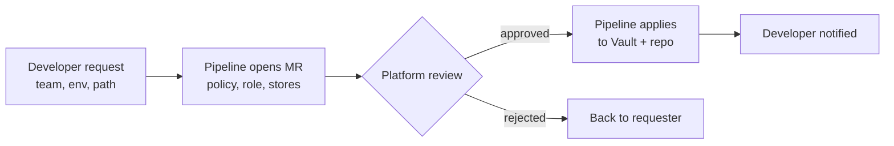

# Vault Secrets Structure — Design

_2026-09-22_

## Summary

Organise Vault secrets into three tiers inside the existing `secret/` mount: shared, per-cluster, and per-team. Platform tokens split by cluster so costs can be attributed; team secrets split by team so no team can read another's.

Access binds to the Kubernetes namespace a workload runs in, through the per-cluster JWT auth mounts that already exist. No new secret engines are needed.

The main cost is scale: 31 clusters means 31 tokens for each per-cluster tool. The main risk is the current ClusterSecretStore, which would bypass team isolation if teams used it (see Store isolation).

## Requirements

Three needs, from OPS-3382 and the planning call:

| Tier | Need | Source | Example |
| --- | --- | --- | --- |
| Shared | One value for every cluster | Planning call | Artifactory pull credentials |
| Per-cluster | A distinct value per cluster, so costs can be told apart | OPS-3382 | Coralogix key, Harness delegate token |
| Per-team | Secrets a team owns, readable only by that team | Planning call | A team application's database credentials |

Two further requirements from the call:

- **Self-service.** Developers using the new portal will need to create secrets, not just read them.
- **Consistency.** The same structure applies in every environment: dev, nonprod, stage, preview and prod.

Today there are only two levels in practice — platform-wide and team-owned — and one Coralogix key serves every cluster in an environment.

## Path convention

Each tier gets its own top-level prefix under the existing `secret/` KV v2 mount:

```
secret/
├── shared/<category>/<tool>                 e.g. shared/platform/artifactory
├── clusters/<cluster>/<category>/<tool>     e.g. clusters/dev-aws-ue1-general-4/observability/coralogix
└── teams/<team>/<app>                       e.g. teams/healthtech/orders-api
```

- `<cluster>` is the exact `CLUSTER_NAME` from the cluster's env file, so paths, policies and Harness connector names all match.
- `<team>` is the team's Kubernetes namespace without the `team-` prefix: `team-healthtech` becomes `healthtech`.
- Paths in ESO `remoteRef.key` omit `secret/`, because the store supplies the mount.

Team paths sit alongside cluster paths rather than under them, on the assumption that a team can run on more than one cluster. If each team lives on a single cluster, `clusters/<cluster>/teams/<team>/` works equally well (see Open questions).

Cluster-first beats service-first (`observability/coralogix/<cluster>`) because each cluster's grant is one prefix, which is simpler to write and audit. Both support equivalent access control.

## Policy templates

One policy per cluster and one per team, generated from these templates rather than written by hand. Paths use the KV v2 `data/` and `metadata/` forms.

**Per cluster** — attached to the cluster's platform role:

```hcl
# cloudops-<cluster>
path "secret/data/clusters/<cluster>/*"     { capabilities = ["read"] }
path "secret/metadata/clusters/<cluster>/*" { capabilities = ["list"] }
path "secret/data/shared/*"                 { capabilities = ["read"] }
```

**Per team** — attached to the team's role:

```hcl
# team-<team>
path "secret/data/teams/<team>/*"     { capabilities = ["read"] }
path "secret/metadata/teams/<team>/*" { capabilities = ["list"] }
path "secret/data/shared/*"           { capabilities = ["read"] }
```

Teams read only. Writes stay with the platform role and the self-service pipeline, so every change to a secret goes through a reviewed path.

Static policies are used rather than one templated policy. A template would depend on the JWT identity alias matching the cluster or team name, and today the alias comes from the service account subject.

## Auth: binding roles to clusters and teams

Each spoke already authenticates through its own JWT mount, `auth/jwt-<cluster>`, created by `scripts/configure-vault-jwt.sh` at registration. Today every spoke's role carries the same policy, so any cluster can read any other cluster's token.

The change is two kinds of role on each spoke's mount:

| Role | Bound to | Policy | Used by |
| --- | --- | --- | --- |
| Platform | The ESO service account | `cloudops-<cluster>` | Platform components |
| Team (one per team) | Every service account in `team-<team>` | `team-<team>` | That team's workloads |

A team role binds on the service account's namespace, so a pod in `team-healthtech` can only ever get a `team-healthtech` token:

```bash
vault write auth/jwt-<cluster>/role/team-healthtech \
  role_type=jwt user_claim=sub bound_audiences=vault \
  bound_claims_type=glob \
  bound_claims='{"sub":"system:serviceaccount:team-healthtech:*"}' \
  token_policies=team-healthtech ttl=1h
```

The Kubernetes namespace becomes the identity boundary, with no new concept to manage. The registration script creates the platform role and policy per cluster; the self-service pipeline creates team roles.

## Store isolation

Team policies alone do not isolate teams while the cluster-wide ClusterSecretStore `vault-backend` exists. It authenticates with the platform role, and any namespace allowed to create an ExternalSecret can point one at it. A team could then read anything the platform role can, including other teams' secrets.

The fix has two parts, and both are needed:

1. **A namespaced SecretStore per team.** Each `team-<team>` namespace gets its own `SecretStore`, authenticating with that team's role. Team ExternalSecrets reference it, so they can only reach the team's paths.
2. **Close the ClusterSecretStore to teams.** Add `spec.conditions` with a `namespaceSelector` so only platform namespaces can use `vault-backend`. Without this, part 1 is a convention rather than a control.

```yaml
spec:
  conditions:
    - namespaceSelector:
        matchLabels:
          platform.intersystems/tier: platform
```

Label the platform namespaces (`argocd`, `coralogix`, `gitea`, `vault`, `external-secrets`) to match. Check the label key against existing conventions before rollout.

The same applies to VSO: team VaultStaticSecrets must use a VaultAuth in their own namespace with the team role, never a shared one.

## Self-service flow

Onboarding a team, or a new secret path for one, runs as a Shipyard pipeline with a human approval gate. The developer portal can call the same pipeline.



The pipeline creates the team's policy, the JWT role on each cluster the team runs on, the namespaced SecretStore, and the empty path. Developers then write values through the pipeline, never directly.

This runs as a script or Terraform, not the Vault Config Operator. Per the hub README, the operator cannot create resources in a namespace it did not authenticate into, which is why spoke registration is already a script.

Deleting a team or path stays manual and needs elevated rights, as agreed on the call.

## Environments

The structure is identical in every environment's Vault namespace; only names differ.

| Environment | Vault namespace | Notes |
| --- | --- | --- |
| Dev | `admin/dev` | Pilot here |
| Nonprod | `admin/nonprod` | Used by the data platforms unit; few or no team secrets yet |
| Stage | `admin/stage` |  |
| Preview | `admin/preview` |  |
| Prod | `admin/prod` | HCP; ESO only, no VSO |
| Sales | `admin/sales` |  |

Each cluster's env file supplies the values that differ, through the kustomize replacement pattern already used for `VAULT_IRSA_ROLE_ARN` and `VAULT_ENT_NAMESPACE`. Manifests in `apps/platform/` stay shared.

## Migration

Each step is reversible until the last one. Old paths stay live until nothing reads them.

1. **Shared tier.** Copy genuinely common secrets, starting with Artifactory, to `shared/`. Repoint consumers, then retire the old paths.
2. **Isolation first.** Add the ClusterSecretStore `namespaceSelector` and label platform namespaces, before any team secrets exist.
3. **Pilot one team in dev.** One team, one spoke: policy, role, namespaced SecretStore, one test secret.
   - Confirm the team can read its own path.
   - **Confirm it gets a 403 on another team's path.** A pilot that only proves access works has not proved isolation.
4. **Per-cluster tokens.** Generate per-cluster Coralogix keys, write them to `clusters/<cluster>/`, repoint one spoke, confirm attribution in Coralogix, then roll out.
5. **Remaining teams**, through the self-service pipeline.
6. **Retire shared tokens.** Only once the Vault audit log shows no reads of the old path across a full refresh interval. Then revoke the old token at the vendor.

Rollback before step 6 is repointing the ExternalSecret back: the old path still exists and still works.

Set `custom_metadata.owner` on every secret as it moves, so ownership is recorded rather than inferred.

## Open questions

- [ ] **Do teams span clusters?** Decides whether team paths sit alongside clusters (as drafted) or under them.
- [ ] **Where do team secrets live today?** Some may be plain Kubernetes Secrets outside Vault, with no rotation or audit. Inventory of spoke namespaces pending.
- [ ] **What is in `apps/`?** Not listable with the ops role. Believed to hold core platform secrets such as gitea and vault.
- [ ] **Coralogix key limit.** Confirm the account allows 31 concurrent keys per environment.
- [ ] **Harness identity.** Name each Harness cost connector with the exact `CLUSTER_NAME`, and decide whether each cluster's delegate gets its own token.
- [ ] **Namespace label key** for the ClusterSecretStore selector: match any existing labelling convention.
- [ ] **Kustomize path construction.** Replacements overwrite whole fields, so the draft uses one full-path variable per secret. Test on one spoke before rollout.
